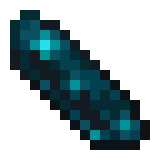

# 🌐 ECHODUPE | NEURAL GAMES HUB
**The central terminal for high-fidelity EchoDupe game environments.**

---

### ⚡ OPERATIONAL SUMMARY
The environment is currently undergoing **System Calibration** and **Neural Path Syncing**. 
Current nodes are restricted as we upgrade to the next generation of the **EchoDupe Evolution Framework**.

*Prepare for a high-fidelity simulation experience.*

**"Get ready to roll."**

---

### 🔗 CONNECTED NETWORKS
[**MAIN HUB PORTAL**](https://echodupe-hub.netlify.app) • [**LIVE TERMINAL**](https://echodupe.github.io/Games/)

---

### 🛠️ SPECIFICATIONS
| Component | Status |
| :--- | :--- |
| **Neural Interface** | Active / Stable |
| **Simulation Core** | Optimizing Assets |
| **Data Stream** | v2.0.6-BETA |

---

  Designed and Maintained by <b>SKITXOE</b> 
  &copy; 2026 ECHODUPE INDUSTRIES

